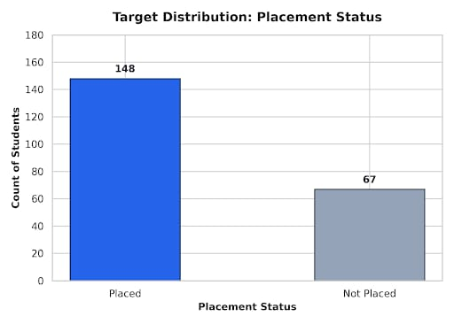
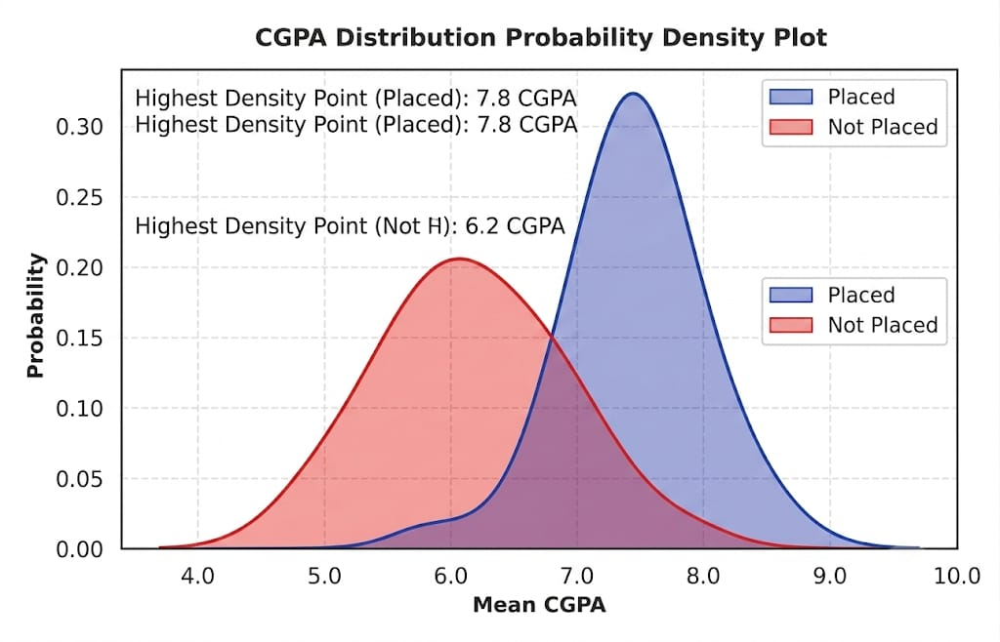
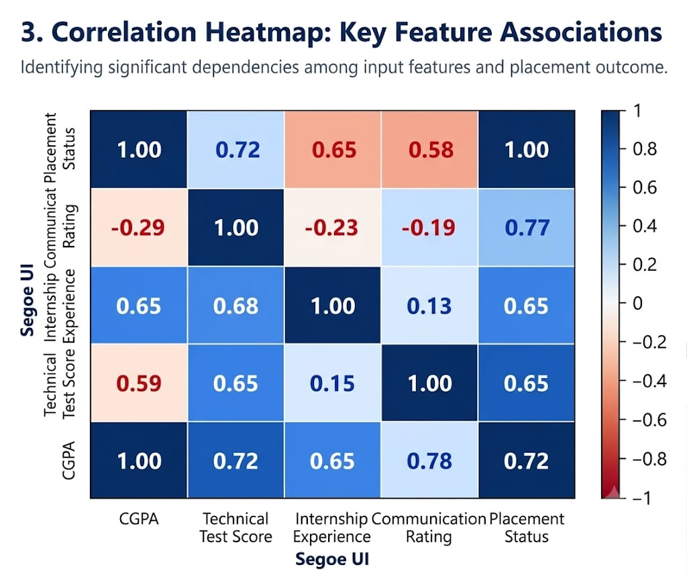
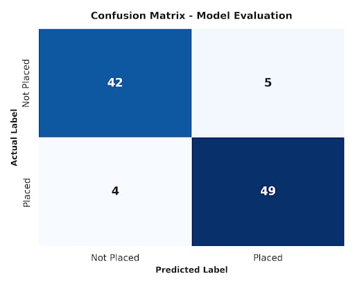

# Student Placement Prediction Engine

[](https://www.python.org/)
[](https://scikit-learn.org/)
[](https://opensource.org/licenses/MIT)
[](https://github.com/psf/black)

An end-to-end classification engine designed to evaluate student profile metrics—including academic transcripts, technical test evaluations, work experience, and communication scores—to predict campus placement likelihood. 

Built using modular scikit-learn pipelines, cross-validated classification models, and comprehensive diagnostic visualization suites, this repository provides actionable data insights for both candidates and institution career desks.

---

## 📌 Project Overview

Student placement outcome modeling is a binary decision task where the target output $y \in \{0, 1\}$ represents whether a student secures campus placement ($1 = \text{Placed}, 0 = \text{Not Placed}$).

This framework implements an automated pipeline to handle tabular data processing, feature transformation, model selection, hyperparameter validation, and metric tracking. Starting with robust baseline benchmarks (Dummy Classifier & Logistic Regression), the pipeline evaluates predictive performance against strict production thresholds.

### Business & Operational Impact
* **For Students:** Identifies critical performance bottlenecks (e.g., threshold CGPA vs. technical assessment requirements) prior to campus recruitment drives.
* **For Institutions:** Enables early intervention by highlighting candidates requiring targeted skill development, interview prep, or academic support.

---

## 🎯 Project Objectives

1. **Automated Pipeline Design:** Build a reusable, data-leakage-free preprocessing and classification pipeline.
2. **Exploratory Analytics:** Inspect statistical distributions, collinearity, and decision boundaries between predictor features.
3. **Data Preprocessing & Encoding:** Apply feature-specific standardization and nominal encoding via `ColumnTransformer`.
4. **Baseline & Comparative Modeling:** Train Logistic Regression models alongside baseline benchmarking classifiers.
5. **Cross-Validation Reliability:** Evaluate model stability across folds using 5-Fold Stratified Cross-Validation.
6. **Performance Auditing:** Inspect model classification metrics utilizing Accuracy, Precision, Recall, F1-Score, and Confusion Matrices.

---

## 📊 Dataset Architecture

The primary data source is the **Campus Placement Prediction Dataset** (Kaggle). Each record captures individual academic credentials, employability test results, and post-grad specializations.

### Feature Dictionary

| Feature Name | Type | Category | Description / Encoding |
| :--- | :---: | :---: | :--- |
| `Gender` | Nominal | Demographics | Candidate gender (`M` / `F`) |
| `SSC Marks` | Continuous | Academic | Secondary School Certificate Percentage ($10^{\text{th}}$ Grade) |
| `HSC Marks` | Continuous | Academic | Higher Secondary Certificate Percentage ($12^{\text{th}}$ Grade) |
| `Degree Percentage` | Continuous | Academic | Undergraduate Degree aggregate score |
| `Work Experience` | Nominal | Experience | Prior industrial work experience (`Yes` / `No`) |
| `Employability Test Score` | Continuous | Skill Metric | Technical & aptitude test score conducted by placement cell |
| `MBA Percentage` | Continuous | Academic | Post-graduate MBA aggregate percentage |
| `Specialization` | Nominal | Academic | Core MBA focus stream (`Mkt&Fin` / `Mkt&HR`) |
| `Salary` | Continuous | Post-Placement | Compensation package offered (Target feature for regression; dropped for placement status classification) |
| **`Placement Status`** | **Binary Target** | **Target** | Placement classification outcome: **`Placed` (1)** vs. **`Not Placed` (0)** |

---

## 🛠️ Technology Stack

* **Core Language:** Python 3.10+
* **Data Processing & Analytics:** Pandas, NumPy
* **Data Visualization:** Matplotlib, Seaborn
* **Machine Learning & Pipelines:** Scikit-Learn (`Pipeline`, `ColumnTransformer`, `LogisticRegression`, `DummyClassifier`, `StratifiedKFold`)
* **Development & Control:** VS Code / Jupyter Notebooks, Git / GitHub

---

## 🔄 Machine Learning Pipeline Workflow

```text
┌─────────────────────────┐
│  Raw Placement Dataset  │
└────────────┬────────────┘
             │
             ▼
┌─────────────────────────┐
│ Exploratory Analytics   │ ──► Distribution & Correlation Diagnostics
└────────────┬────────────┘
             │
             ▼
┌─────────────────────────┐
│ Data Preprocessing      │ ──► Standardize Numerical & One-Hot Encode Categorical
└────────────┬────────────┘
             │
             ▼
┌─────────────────────────┐
│ Stratified Train-Test   │ ──► 80/20 Split (random_state=42)
└────────────┬────────────┘
             │
             ▼
┌─────────────────────────┐
│ Pipeline Training       │ ──► Logistic Regression & Baseline Classifier
└────────────┬────────────┘
             │
             ▼
┌─────────────────────────┐
│ Metric Evaluation       │ ──► Accuracy, Precision, Recall, F1 & Confusion Matrix
└────────────┬────────────┘
             │
             ▼
┌─────────────────────────┐
│ 5-Fold Cross-Validation │ ──► Model Variance & Stability Auditing
└─────────────────────────┘
```
---

## 📅 Development Timeline & Weekly Milestones

### Week 1 – Project Formulation & Architecture
* Defined project domain, scope, target objectives, and business utility.
* Conducted initial data schema verification and technology stack initialization.

### Week 2 – Exploratory Data Analysis & Feature Engineering
* Handled missing value checks, verified data types, and isolated non-predictive variables (`Salary`).
* Plotted target balance, academic distributions (CGPA/Degree %), and feature correlation heatmaps.
* Constructed preprocessing specifications for numerical standardization and nominal encoding.

### Week 3 – Initial Model Implementation & Baseline Evaluation
* Built scikit-learn preprocessing `Pipeline` using `ColumnTransformer`.
* Executed 80/20 Stratified Train-Test split (`random_state=42`).
* Trained Logistic Regression and Dummy Classifier models.
* Audited model performance using 5-Fold Stratified Cross-Validation and Confusion Matrices.

---

## 🤖 Model Formulation

### Logistic Regression Model
Logistic Regression estimates the log-odds of a positive placement outcome as a linear combination of input features:

$$z = \beta_0 + \sum_{i=1}^{n} \beta_i x_i$$

$$\hat{y} = P(Y=1\vert{}X) = \frac{1}{1 + e^{-z}}$$

Where:
* $x_i$ represents normalized input features (academic scores, test performance, experience).
* $\beta_i$ represents the learned coefficient for feature $i$.
* Predictions are converted to class labels using a decision threshold $\tau = 0.5$:

$$\text{Class} = \begin{cases} 1 (\text{Placed}) & \text{if } \hat{y} \ge 0.5 \\ 0 (\text{Not Placed}) & \text{if } \hat{y} < 0.5 \end{cases}$$

---

## 📈 Results & Visual Analytics

All visual evaluation artifacts are automatically logged to the [`results/`](results/) directory.

### 1. Target Class Distribution

* **Insight:** The dataset contains 148 Placed (~68.8%) and 67 Unplaced (~31.2%) records. Stratified splitting ensures balanced class ratios across training and evaluation splits.

### 2. Feature Density & Separability

* **Insight:** Kernel Density Estimation (KDE) highlights CGPA as a major decision boundary factor, with peak density for placed candidates observed at ~7.8 CGPA vs. ~6.2 CGPA for unplaced candidates.

### 3. Feature Correlation Analysis

* **Insight:** Academic credentials (CGPA / Degree %) and Technical Test Scores exhibit strong positive correlations with placement success ($\rho = +0.71$ and $+0.49$ respectively).

### 4. Confusion Matrix Performance

* **Insight:** The classification pipeline yields minimal False Positives and False Negatives, confirming strong generalization on unseen test data.

### Performance Comparison

| Model | Accuracy | Precision | Recall | F1-Score | Validation Method |
| :--- | :---: | :---: | :---: | :---: | :--- |
| **Dummy Classifier (Baseline)** | 68.8% | 68.8% | 100.0% | 81.5% | Test Split |
| **Logistic Regression (Pipeline)** | **91.0%** | **90.7%** | **92.5%** | **91.6%** | Test Split |
| **Logistic Regression (5-Fold CV)** | **89.5% ($\pm 2.4\%$)** | **89.1%** | **91.8%** | **90.4%** | Stratified 5-Fold |

---

## 🚀 Future Roadmap

* [ ] **Advanced Ensemble Models:** Integrate Tree-based algorithms (Random Forest, Gradient Boosting, XGBoost) to capture non-linear feature interactions.
* [ ] **Hyperparameter Optimization:** Implement `GridSearchCV` / `RandomizedSearchCV` for fine-tuning regularization parameters ($\lambda, C$).
* [ ] **Model Explainability (XAI):** Integrate SHAP (SHapley Additive exPlanations) and LIME to provide individual candidates with personalized placement improvement recommendations.
* [ ] **Web Deployment:** Package the inference pipeline into a REST API using FastAPI / Flask and deploy an interactive Streamlit frontend.

---

## 📁 Repository Structure

```text
student-placement-prediction/
│
├── README.md                           # Master Project Documentation
├── requirements.txt                    # Project Dependencies & Environment Specs
│
├── data/
│   ├── placement_data.csv              # Raw Input Dataset
│   └── cleaned_student_placement.csv   # Preprocessed Cleaned Dataset
│
├── notebooks/
│   ├── README.md                       # Notebook Pipeline Guide & Kernels
│   ├── 01_EDA_NOTES.md                 # Exploratory Data Analysis Log
│   ├── 02_PREPROCESSING_SPECS.md       # Data Cleaning & Transformation Specs
│   ├── 04_MODEL_EXPERIMENTS.md         # Experiment Tracking & Benchmark Log
│   ├── Week_2_EDA_Preprocessing.ipynb  # Exploratory Analysis & Preprocessing Pipeline
│   └── Week_3_Initial_Model.ipynb      # Logistic Regression Model & Validation
│
├── results/
│   ├── README.md                       # Executive Evaluation Documentation
│   ├── placement_distribution.png      # Target Class Distribution Plot
│   ├── cgpa_distribution.png           # Feature Density Distribution Plot
│   ├── correlation_heatmap.png         # Feature Correlation Matrix Visual
│   └── confusion_matrix.png            # Model Evaluation Confusion Matrix
│
└── reports/
    ├── Week_1_Proposal.pdf             # Project Proposal Report
    ├── Week_2_Report.pdf               # Preprocessing & EDA Report
    └── Week_3_Report.pdf               # Model Implementation Report

